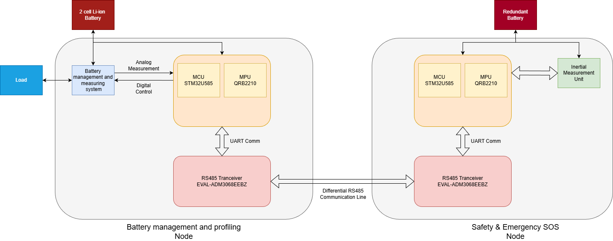

# EZ-EV Smart Transportation Challenge Application

# Project Title

EVA Guardian

Intelligent EV Battery Insight, Safety & Emergency Redundancy System

---

# Project Overview

Electric vehicles have transformed personal transportation, but challenges such as range anxiety, battery degradation, connector failures, and emergency preparedness continue to impact user confidence and safety.

EVA Guardian is a smart EV monitoring and safety platform designed to provide comprehensive battery insights, predictive safety diagnostics, emergency assistance capabilities, and backup power redundancy.

The project combines battery analytics, connector health monitoring, vibration-based incident detection, emergency SOS functionality, and a redundant emergency power subsystem into a single intelligent platform.

Using the Arduino UNO Q SBC, Analog Devices isolated communication hardware, Molex automotive connectors, and LabVIEW visualization tools, EVA Guardian demonstrates how future EVs can become safer, more reliable, and more resilient during emergency situations.

---

# Problem Statement

Modern EVs provide battery percentage information but often do not offer sufficient visibility into:

* Actual battery health
* Remaining usable range
* Battery stress conditions
* Connector degradation
* Vehicle vibration anomalies
* Emergency communication readiness

Additionally, in severe failure scenarios, vehicle occupants may lose access to communication devices if the primary battery system becomes unavailable.

The objective of EVA Guardian is to address these gaps through predictive diagnostics and emergency redundancy mechanisms.

---

# Project Objectives

<figure>

  
   
  <em>Figure 1: EVA Guardian System</em>

</figure>

The project will focus on four major areas:

## 1. Battery Insight System

Monitor and analyze:

* Battery voltage
* Current consumption
* Power usage
* Temperature
* Charging behavior

The system will calculate:

* State of Charge (SOC)
* Estimated Remaining Range
* Battery Health Index
* Efficiency Metrics
* Remaining Runtime Estimation

The user receives actionable information instead of a simple battery percentage.

---

## 2. Connector Health Monitoring

Automotive connector degradation can lead to:

* Increased resistance
* Excessive heating
* Power loss
* Intermittent failures

Using Molex automotive connectors, the project will monitor:

* Connector temperature
* Connection continuity
* Voltage drop across connectors
* Connector degradation trends

Predictive warnings will be generated before failures occur.

---

## 3. EV Safety Monitoring

The system will continuously monitor:

* Sudden impacts
* Excessive vibration
* Vehicle rollover conditions
* Abnormal motion patterns

Using IMU-based sensing and analytics, EVA Guardian can detect potential accident scenarios and trigger emergency workflows.

---

## 4. Emergency SOS & Redundancy System

One of the most important features of the project is the emergency response subsystem.

In the event of:

* Vehicle breakdown
* Main battery failure
* Collision event
* Emergency situation

The system will activate a dedicated backup power module.

The backup subsystem will provide sufficient energy for:

* Emergency SOS transmission
* GPS location reporting
* Mobile phone charging
* Emergency lighting

This ensures that critical communication remains available even when the primary EV battery system becomes unavailable.

---

# System Architecture

The architecture consists of:

## Battery Monitoring Node

Measures:

* Voltage
* Current
* Temperature
* Power consumption

## Safety Monitoring Node

Measures:

* Vibration
* Impact
* Vehicle motion

## Connector Monitoring Node

Measures:

* Temperature
* Voltage drop
* Continuity

## Emergency Redundancy Node

Provides:

* Backup battery management
* Emergency power routing
* SOS activation

## Central Analytics Node

Implemented on the Arduino UNO Q SBC.

Responsible for:

* Sensor fusion
* Predictive analytics
* Data logging
* Alert generation
* Dashboard communication

---

# Utilization of Challenge Hardware

## Arduino UNO Q SBC

Used as the intelligent analytics engine responsible for:

* Battery calculations
* Safety event processing
* Dashboard services
* Data storage
* Emergency management logic

---

## Analog Devices EVAL-ADM3068EEBZ

Used as a robust isolated communication backbone between distributed monitoring nodes.

Functions include:

* Sensor node communication
* Safety message transport
* Fault-tolerant communication

This demonstrates reliable communication suitable for transportation environments.

---

## Molex Automotive Connectors

Used as monitored interconnects within the power distribution network.

The project will evaluate:

* Connector temperature rise
* Voltage drop
* Connection degradation

while demonstrating predictive maintenance techniques.

---

## LabVIEW

Used to create an EV operations dashboard displaying:

* State of Charge
* Battery Health
* Estimated Range
* Efficiency Metrics
* Connector Health
* Vibration Status
* Emergency Events
* SOS Activity Logs

---

# Key Innovations

## Battery Intelligence Instead of Battery Percentage

Provide meaningful information including battery health and range prediction.

## Connector Health Analytics

Predict connector failures before they become safety hazards.

## Emergency Backup Power System

Maintain critical communication even when the primary battery system becomes unavailable.

## Automatic SOS Assistance

Trigger emergency actions following severe impact events.

## Distributed Safety Architecture

Utilize isolated communication to improve reliability and fault tolerance.

---

# Expected Deliverables

* Intelligent battery monitoring system
* State of Charge estimation engine
* Range prediction system
* Connector degradation monitoring
* Impact and vibration detection system
* Emergency SOS subsystem
* Backup power subsystem
* LabVIEW visualization dashboard
* Complete technical documentation
* Demonstration video

---

# Why This Project Matters

As EV adoption continues to grow, safety, reliability, and emergency preparedness become increasingly important.

EVA Guardian demonstrates how intelligent monitoring, predictive diagnostics, and emergency redundancy can improve both vehicle safety and user confidence while utilizing readily available embedded technologies.

The concepts demonstrated in this project can be extended to future electric two-wheelers, passenger vehicles, fleet vehicles, and smart transportation platforms.
